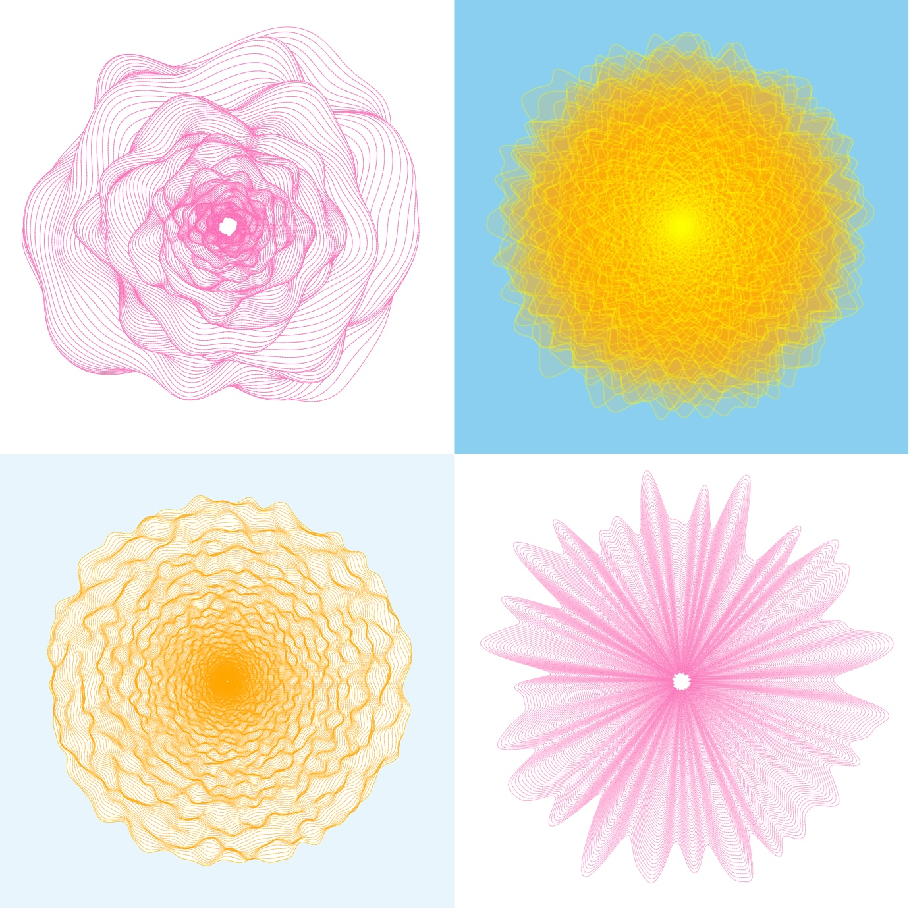

# Simplex Flowers

Code to generate abstract flowers using Simplex Noise.

A description of how this code works as well as an interactive demo can be found in 
the [blog post](https://www.benfrederickson.com/flowers-from-simplex-noise/).



## Usage

To view the example files (index.html and interactive.html), you will first need to generate the bundle.js file:

```sh
npm run bundle
```

or to build a debug version that will watch for changes:

```sh
npm run watch
```

To use the code in a different project you will need to install the code via npm:

```
npm install simplex-flowers
```

After which the code can be called like:


### JavaScript
```javascript
var simplex_flowers = require('simplex-flowers');

// Draw the 2x2 grid shown above in a 'flowers' div
simplex_flowers.drawExampleGrid(document.getElementById("flowers"));

// Draws a single flower into a canvas context ctx
drawFlower(ctx, {x: width / 2, y: height / 2, radius},
           8.72, 0.07, 0.15, 0.99, 500);
```

### TypeScript
```typescript
import { drawExampleGrid, drawFlower } from 'simplex-flowers';

// Draw the 2x2 grid shown above in a 'flowers' div
drawExampleGrid(document.getElementById("flowers"));

// Draws a single flower into a canvas context ctx
drawFlower(ctx, {x: width / 2, y: height / 2, radius},
           8.72, 0.07, 0.15, 0.99, 500);
```
